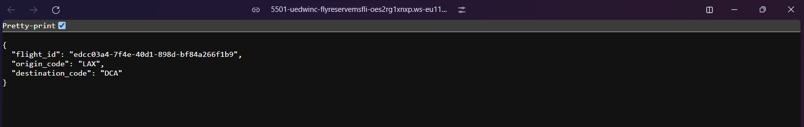
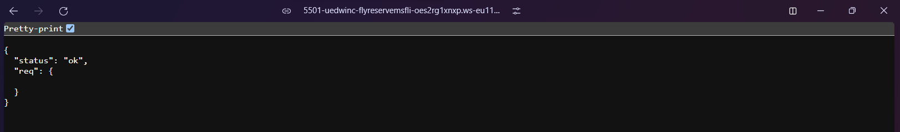

# Microservices development

## Microservice Endpoints

There are two microservice endpoints:

1. The flights management microservice: _flyreserve-ms-flights_

2. The reservations management microservice: _flyreserve-ms-reservations_

We can describe the interactions represented by various jobs, using UML sequence diagrams in PlantUML format:


The reservations microservice will be implemented in _Python_ and _Flask_, while the flights microservice will be implemented in _Node/Express.js_.

## The Database

We ensure the two microservices do not share any data space, so we implement them using entirely different backend data systems: Redis for the reservations and MySQL for flights.

1. Redis for the Reservations Data Model

2. MySQL Data Model for the Flights Microservice

## Code for the Microservices

### 1. Flights microservice

Create a new GitHub repository: flyreserve-ms-flights

Clone the following [repository](https://github.com/implementing-microservices/ms-flights) and change the remote origin url to the new GitHub repository

Final repository for the flights microservice: https://github.com/uedwinc/flyreserve-ms-flights

- Use GitPod to test the containers locally

- When everything is working, you should be able to access your /flights endpoint locally at a URL like the following: http://0.0.0.0:5501/flights?flight_no=AA34&departure_date_time=2020-05-17T13:20



- The seat_maps endpoint should appear in a URL: http://0.0.0.0:5501/flights/AA2532/seat_map



**Health checks**

To manage the life cycle of the containers that the app will be deployed into, most container-management solutions (e.g., Kubernetes) need a service to expose a health endpoint. In the case of Kubernetes, you should generally provide liveness and readiness endpoints.

A simple “Am I live?” check at **/ping** (known as a _liveness probe_ in Kubernetes) and a more advanced “Is the database also ready? Can I actually do useful things?” check (known as the _readiness probe_ in Kubernetes) at **/health** is implemented. Using two probes for overall health is very convenient since a microservice being up doesn’t always mean that it is fully functional. If its dependency, such as a database, is not up yet or is down, it won’t be actually ready for useful work.

If everything was done correctly and the microservice is up and running in a healthy way, if you now run `curl http://0.0.0.0:5501/health`, you should get a health endpoint output that looks like the following:

```json
{
  "details": {
    "db:dbQuery": {
      "status": "pass",
      "metricValue": 15,
      "metricUnit": "ms",
      "time": "2020-06-28T22:32:46.167Z"
    }
  },
  "status": "pass"
}
```

- If you run `curl http://0.0.0.0:5501/ping` instead, you should get a simpler output:

```json
{ "status": "pass" }
```

- We now have a fully functioning ms-flights microservice implemented with Node.js and MySQL

### 2. Reservations microservice

Implementing the flyreserve ms-reservations microservice in Python and Flask using the Redis data store

Create a new GitHub repository: flyreserve-ms-reservations

Clone the following [repository](https://github.com/implementing-microservices/ms-reservations) and change the remote origin url to the new GitHub repository

Final repository for the flights microservice: https://github.com/uedwinc/flyreserve-ms-reservations

## Hooking Services Up with an Umbrella Project

We need an easy-to-use umbrella project, one that can launch all of our microservice specific subprojects in one simple command and make them all work together nicely, until such time as we decided to shut down the umbrella project with all of its components.

To deploy an easy-to-use umbrella project, we’ll use the microservices workspace template available at https://github.com/inadarei/microservices-workspace and start a workspace for us at https://github.com/implementing-microservices/microservices-workspace

To check out repositories of individual microservices under the umbrella repository, we use the open source project [Faux Git Submodules](https://github.com/inadarei/faux-git-submodules)

The idea is to make it easy to descend into a subfolder of your workspace repository containing a microservice and treat it as a fully functioning repository, which you can update, commit code in, and push to.

We’ll start by indicating the two repos we’ve just created as the components of the new workspace, by editing the _fgs.json_ file to look something like the following:

```json
{
  "ms-flights" : {
    "url" : "https://github.com/implementing-microservices/ms-flights"
  },
  "ms-reservations" : {
    "url" : "https://github.com/implementing-microservices/ms-reservations"
  }
}
```

In the last configuration we indicated ms-flights and ms-reservations using the read-only “http://” protocol. This was done so that you can follow the example. In real projects, you would want to pull your repositories with the read/write “git://” protocol so you can modify them

Now that we have configured repos.json, let’s pull the ms-flights and ms-reservations microservices into the workspace:

```sh
make update
```

This operation also helpfully adds the checked-out repositories to the _.gitignore_ of the parent folder, to prevent the parent repository trying to double-commit them into the wrong place

We also need to edit the bin/start.sh and bin/stop.sh scripts to make changes from the default

  1. _bin/start.sh_

```sh
#!/usr/bin/env bash
set -eu

export COMPOSE_PROJECT_NAME=msupandrunning

pushd ms-flights && make start
popd
pushd ms-reservations && make start
popd

make proxystarts
```

  2. _bin/stop.sh_

```sh
#!/usr/bin/env bash
set -eu

export COMPOSE_PROJECT_NAME=msupandrunning

pushd ms-flights && make stop
popd

pushd ms-reservations && make stop
popd

make proxystop
```

To keep things simple yet powerfully automated, our workspace setup is using the [Traefik edge router](https://traefik.io/traefik/) for seamless routing to the microservices. It gets installed by our [docker-compose.yml](https://github.com/inadarei/microservices-workspace/blob/master/docker-compose.yml) file

We will need to add Traefik-related labels to the `dockercompose.yml` files of both microservices to ensure proper routing of those services:

  1. _ms-flights/docker-compose.yaml_

```yml
services:
  ms-flights:
    container_name: ms-flights
    labels:
      - "traefik.enable=true"
      - "traefik.http.routers.ms-flights.rule=PathPrefix(`/reservations`)"
```

  2. _ms-reservations/docker-compose.yaml_

```yml
services:
  ms-reservations:
    container_name: ms-reservations
    labels:
      - "traefik.enable=true"
      - "traefik.http.routers.ms-reservations.rule=PathPrefix(`/reservations`)"
```

We also need to update the umbrella project’s name (which serves as the namespace and network name for all services) in the workspace’s makefile, so that instead of `project:=ms-workspace-demo`, it says:

```
project:=msupandrunning
```

Once you bring up the workspace by running `make start` at the workspace level, you will be able to access both microservices in their attached-to-workspace form

We mounted Traefik to local port 9080, making http://0.0.0.0:9080/ our base URI. Therefore, the following two commands are querying the reservations and flights systems:

```sh
curl http://0.0.0.0:9080/reservations?flight_id=qwerty
```

```sh
curl \
http://0.0.0.0:9080/flights?\
flight_no=AA34&departure_date_time=2020-05-17T13:20
```